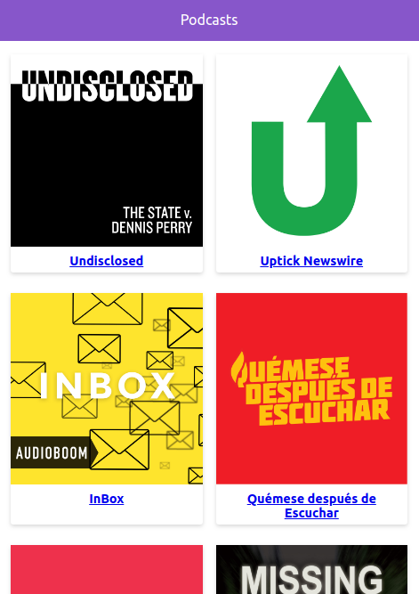

# App de Podcasts

App de ppodcasts integrada con la API de AudioBoom con Next.JS

[Ver la aplicación](https://podcasts-kg6jtquxk.now.sh/)

## ¿Cómo funciona?

Requiere Node.JS 10

* `npm install` para instalar las dependencias.
* `npm run dev` para el entorno de desarrollo.
* `npm run build && npm start` para el entorno de producción.

## Licencia 

MIT